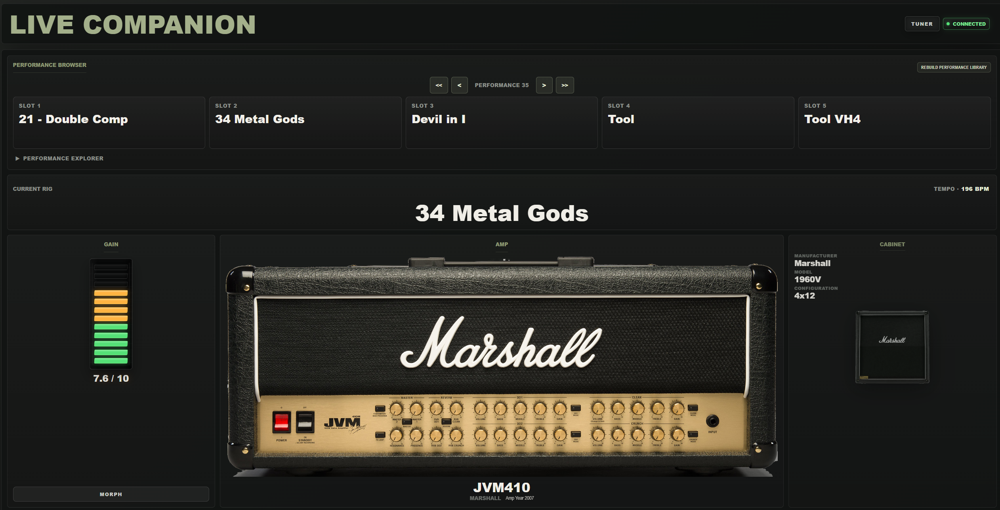
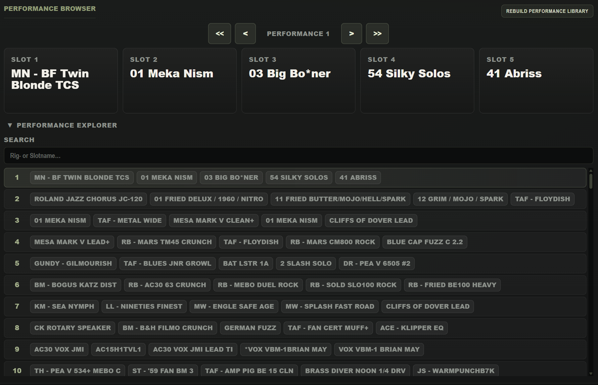

# Kompanion v2.0



A real-time monitoring and control companion for Kemper Profiler.

## Video Demonstrations

### Kempanion v2.0 Overview

[[Video Link]](https://youtu.be/eZKvXai_k7g)

### Adding Custom Amp Images

[[Video Link]](https://youtu.be/Fl0tA2Wt3qE)

---

## What is Kompanion?

**Kompanion** is a desktop application for the Kemper Profiler. Its main module, **Kempanion**, provides real-time rig monitoring and performance controls.

Kompanion combines live rig visualization with practical performance controls, allowing guitarists to monitor and interact with their Profiler from a dedicated desktop application.

The application communicates directly with the Kemper via MIDI SysEx and MIDI control messages and automatically updates all displayed information in real time.

Additional modules include **Gear Atlas** and **Audio Tools**.

---

## Features

### Real-Time Monitoring (Kempanion)

* Live rig information
* Live amp information
* Live cabinet information
* Live gain display
* Real-time effect monitoring
* Automatic rig change detection
* Automatic image matching for amps, cabinets and effects

### Performance Browser



* Browse stored Kemper performances
* Performance Explorer
* Search rigs across all scanned performances
* Direct performance navigation
* Direct slot selection
* Local performance library

### Live Control

* Slot selection
* Performance navigation
* Effect on/off control
* Tuner control
* Morph trigger
* Tap Tempo
* BPM display
* BPM input and setting

### User Experience

* Boot screen
* No-MIDI connection screen
* Automatic Kemper detection
* Performance library rebuild
* Scan progress indicator
* Native Windows desktop application built with Tauri

---

## Requirements

* Windows
* Kemper Profiler
* USB connection between Kemper and computer

Rig Manager is optional and not required.

---

## Installation

### Option 1: Use a Release Build

Download the latest installer from the GitHub Releases page and install the application normally.

After installation, launch **Kompanion** from the Windows Start Menu.

### Option 2: Build from Source

Clone the repository:

```bash
git clone https://github.com/edmei014/Kemper-Live-Companion.git
cd Kemper-Live-Companion
```

Install dependencies:

```bash
npm install
```

Build the application:

```bash
npm run tauri build
```

After a successful build, the executable can be found at:

```text
src-tauri\target\release\live_companion.exe
```

The generated Windows installer (NSIS) can be found at:

```text
src-tauri\target\release\bundle\nsis
```

The installer shows a Kempanion information page first (unsigned open-source notice), then the normal Tauri/NSIS setup. That page does not change or bypass Windows SmartScreen. The custom page is defined in `src-tauri/windows/nsis/installer.nsi` and selected via `bundle.windows.nsis.template` in `src-tauri/tauri.conf.json`.

---

## How It Works

Kompanion communicates directly with the Kemper Profiler through MIDI SysEx and MIDI control messages.

The application automatically requests and updates information from the Profiler while also providing selected control functions.

Currently supported:

### Read

* Rig Name
* Amp Name
* Amp Model
* Amp Manufacturer
* Amp Production Year
* Cabinet Information
* Gain Value
* Effect Slot Names
* Effect States
* Current BPM

### Control

* Performance Selection
* Slot Selection
* Effect Toggle
* Morph Trigger
* Tuner Toggle
* Tap Tempo
* BPM Setting

---

## Performance Library

The Performance Library allows users to build a local database of their Kemper performances.

Features:

* Performance scanning
* Local storage
* Fast browsing
* Rig search across performances
* Direct navigation from browser to performance slot

The library can be rebuilt at any time using the integrated rebuild function.

---

## Custom Images

Amp, cabinet and effect images are stored in:

```text
public/images/amps
public/images/cabinets
public/images/effects
```

Users can add their own images to support additional equipment.

Relevant files:

```text
src/library/index.js    Public Gear Library API (import from here)
src/data/amps/          Amp records by manufacturer
docs/GEAR_LIBRARY.md    Architecture and contribution guide
```

See [docs/GEAR_LIBRARY.md](docs/GEAR_LIBRARY.md) for how to add amps, manufacturers, and future categories.

Legacy image map files (`src/ampImageMap.js`, etc.) have been replaced by the Gear Library.

Photopea is a useful free tool for background removal and image preparation.

---

## Limitations

* No rig editing
* No profile creation
* No profile management
* No deep parameter editing
* Image matching depends on available aliases and image files

---

## Development Highlights

* MIDI SysEx communication
* MIDI control implementation
* Real-time Kemper monitoring
* Performance library system
* Performance browser
* Effect control system
* Automatic image matching
* Native desktop deployment using Tauri

---

## Disclaimer

Kompanion is an independent third-party project.

This application is not affiliated with, endorsed by, sponsored by, or approved by Kemper GmbH or the Kemper Profiler product team.

"Kemper" and "Kemper Profiler" are trademarks of their respective owners and are referenced solely for compatibility and descriptive purposes.

Kompanion is developed independently and is intended to provide additional monitoring and control functionality for users of the Kemper Profiler platform.

---

## Project Status

Actively developed personal project focused on live Kemper monitoring and performance navigation.
