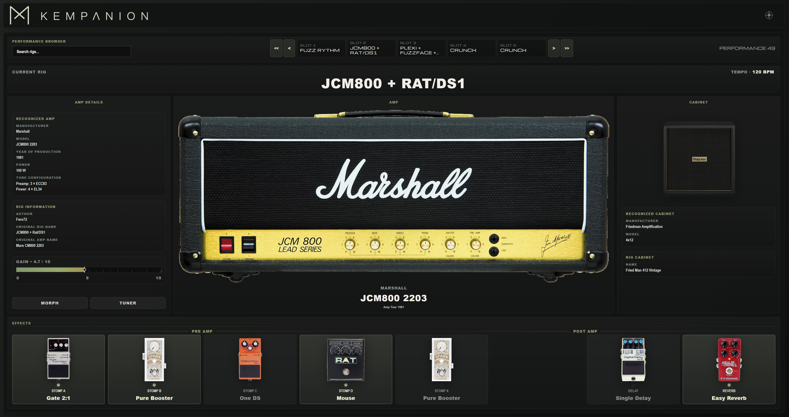
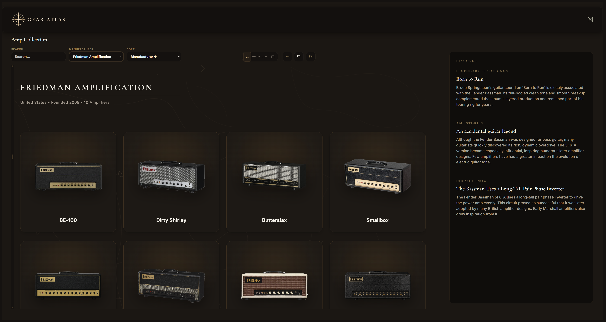

# Kompanion

Kompanion is a desktop application for the Kemper Profiler. It combines practical live features with a visual amp database — as one connected system, not two separate programs.

---

## The Idea Behind Kompanion

Kompanion is meant to do more than control the Kemper technically. It aims to make the musical workflow more visual and intuitive.

A central idea is the link between the rig you are actually using and the real amplifier behind it. Instead of seeing only names and parameters, the musician should be able to recognize the amp in use — as an image, as a model, as something tangible — and quickly learn more about that piece of gear.

Two closely connected areas serve this purpose:

- **Kempanion** — the live / Kemper side for practical use at the Profiler
- **Gear Atlas** — the visual amp and gear database

Both share the same core idea: what runs on the Kemper becomes a visual entry point to the equipment behind it.

---



## Kempanion

Kempanion is the live area of Kompanion. Here the application connects to a Kemper Profiler and makes the current setup easy to grasp at a glance.

Typical tasks in Kempanion:

- Connection to the Kemper Profiler and display of the current connection status
- Current rig and performance information — which rig is active, which performance is loaded
- Visual representation of the amp in use, when a matching model is found in the database
- Live-oriented workflow — overview instead of a wall of parameters, focus on what matters on stage or while practicing
- Performance Browser — browse saved performances and their slots / rigs
- Timeline and Presentation Mode — accessible through the Gear Atlas (see below), but part of the same overall system

Kempanion is deliberately built for practical use: see quickly, switch quickly, understand quickly which amp is in play.

---

## Performance Browser

The Performance Browser makes Kemper performances easy to work with, without fighting through menus.

A Kemper performance can contain multiple slots — several rigs within one setup. Kempanion displays these slots clearly, so it is easy to see which rigs are available in a performance and which one matters right now.

The user can:

- browse performances from the local performance library
- select and load individual slots / rigs
- see the amp visually, when a matching model could be assigned

**Clicking the amp image** opens the **amp detail view** — an in-depth look at the recognized amplifier with image, model information, and further details from the gear database.

From there, the step into the Gear Atlas is natural: via the **Gear Atlas signet** in the top right (compass icon), the user switches directly to the Gear Atlas and stays in the same visual context — on the amp that was just in focus.

---

## The Connection to the Gear Atlas

The Gear Atlas is Kompanion’s central visual amp database. It contains the amp models Kempanion can display — with images, manufacturers, model names, and further information.

### How Rigs and Amps Find Each Other

When a Kemper rig’s rig name or other amp labels match a model in the Gear Atlas, Kempanion can assign and display that amplifier. Matching is based on the names and labels reported by the Kemper and the entries in the database.

This is also helpful when **automatic recognition does not work perfectly**:

- If an amp already exists in the Gear Atlas, the user knows that model is in the database.
- They can use the Atlas naming as guidance — for example, to choose rig names more deliberately or to improve matches over time.

Kompanion does not promise flawless automation for every conceivable rig name. But it creates a *visual bridge* between what runs on the Kemper and what the amplifier is in the real world.
This turns a rig name into a visual entry point to the equipment behind it.

---

## Gear Atlas

The Gear Atlas is the heart of Kompanion’s visual side — a collection of real amplifiers, searchable, filterable, and available in different presentation styles.



### Overview and Navigation

In the Gear Atlas, the user finds:

- a visual overview of amps as cards
- search across the collection
- manufacturer filter — narrow the collection by manufacturer so a large set of models becomes a manageable selection
- different views and sort orders — by manufacturer, model, chronology, and more
- amp cards as a visual entry point — click opens the detail view

### Manufacturer

The manufacturer filter is especially important for orientation in a large collection. Instead of seeing every amp at once, the user can focus on a specific manufacturer and their models — from classic British brands to modern boutique amplifiers.

### Amp Detail

The detail view of an amplifier puts a single model center stage: large amp image, manufacturer, model, description, history, and further information — as available in the database.

From the detail view, the link back to the Kempanion workflow remains: someone who has explored an amp in the Atlas will recognize it later on the live page — and vice versa.

### Switching Between Kempanion and Gear Atlas

Both areas are always within reach:

- from **Kempanion**, the **compass signet** leads to the Gear Atlas
- from the **Gear Atlas**, the **Kempanion signet** returns to the live page

Context is preserved — the musician moves between playing and exploring without losing the thread.

---

## Special Display Modes in the Gear Atlas

The Gear Atlas offers different design modes — the same amp data, different visual perspectives.

### Standard / Collections

In the standard overview and Collections mode, multiple amps are shown as cards. The collection stays searchable and opens amp by amp into the detail view. Collections groups amps thematically into clear boxes — well suited for exploratory browsing.

### Museum Mode

Museum Mode is a deliberately different experience: more visual, more immersive, focused on one amplifier at a time. Instead of a classic database or list view, the amp itself takes center stage — like an exhibition, not a catalog.

Museum Mode and Presentation Mode are not the same — Museum is a display style within the Gear Atlas; Presentation Mode is a separate full-screen mode (see below).

### Amp Detail

Regardless of the selected mode, clicking an amp leads to the detail view — the in-depth, information-rich single-amp view with strong visual focus on the amplifier.

---

## Timeline

The Timeline in the Gear Atlas arranges amps chronologically — by year of production and era. Instead of sorting alphabetically or by manufacturer, a temporal arc through amplifier history emerges.

This is especially useful when you want to:

- discover amps from a particular era
- understand the historical context of models
- browse the collection as a map through time

The Timeline is an exploration view within the Gear Atlas — not a replacement for the Performance Browser, but a different perspective on the same database.

---

## Presentation Mode

Presentation Mode is a focused full-screen mode for situations where visual presentation should come first — while playing, practising, presenting, or simply when the normal app chrome should step back.

In Presentation Mode:

- the standard interface is reduced
- visual content moves more strongly to the centre
- amps can be viewed in a low-distraction environment

Presentation Mode is independent of Museum Mode. Museum defines how an amp is shown; Presentation Mode defines the frame in which it is shown — full screen, reduced, presentation-oriented.

---

## Why the Gear Atlas Is More Than a Gallery

The Gear Atlas is not just a list of filenames or images. Over time, it is meant to become a visual reference for the amplifiers a musician uses in Kemper rigs — or wants to use.

The connection to Kempanion makes the difference:

| Step | Meaning |
|------|---------|
| **Rig** | What is running on the Kemper right now |
| **Amp** | Which real amplifier lies behind it |
| **Detail** | What you can learn about that model |
| **Gear Atlas** | Where the full collection lives and can be explored |

This turns an abstract rig name into a **visual entry point** to real equipment — and turns the database into a tool that enriches the live workflow instead of existing in parallel beside it.

---

## Installation & Getting Started

### Requirements

- **Windows**
- **Kemper Profiler** — for live features in Kempanion
- **MIDI connection** between Kemper and computer (e.g. via a MIDI interface)

The Gear Atlas is usable without a connected Kemper — but live features require a connection to the Profiler.

### Installation

1. Download the installer from this project’s GitHub Releases page
2. Install Kompanion on Windows as usual
3. Launch Kompanion from the Start menu
4. Turn on the Kemper, establish the MIDI connection, and select the correct MIDI input and output in Kompanion

After connecting, Kempanion updates with information from the Profiler. The performance library can be built separately to populate the Performance Browser.

### Building from Source

```bash
git clone https://github.com/edmei014/Kompanion.git
cd Kompanion
npm install
npm run tauri:build
```

The finished installer is located after the build at `src-tauri/target/release/bundle/nsis/`.

---

## Project Status

Kompanion is a release-ready project in an early release stage. Kempanion and Gear Atlas are functionally connected; the amp database continues to grow.

Video guides and supplementary media may be added in a dedicated section in the future.

---

## Author

**edmei014** — [github.com/edmei014](https://github.com/edmei014)

---

## Disclaimer

Kompanion is an independent third-party project. It is not officially affiliated with Kemper GmbH and is neither supported nor endorsed by Kemper.

“Kemper” and “Kemper Profiler” are trademarks of their respective owners and are used here solely to describe compatibility.
