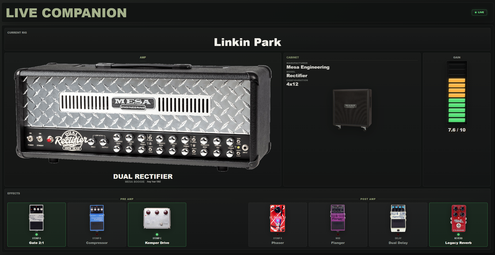

# Live Companion



## Video Demonstrations

### Real-Time Monitoring Demo

[[Video Link]](https://youtu.be/3wBTPzdFYO0)

### Adding Custom Amp Images

[[Video Link]](https://youtu.be/Fl0tA2Wt3qE)


## What is Live Companion?

A real-time visual companion for the Kemper Profiler that displays live rig, amp, cabinet and effect information via MIDI SysEx.

The application automatically detects rig changes and updates the displayed information, including amp, cabinet and effect images.

## Features

* Real-time Kemper Profiler monitoring
* Automatic rig change detection
* Live amp information
* Live cabinet information
* Live gain display
* Live effect slot monitoring
* Automatic image matching for amps, cabinets and effects
* Native Windows desktop application built with Tauri

## Requirements

* Windows
* Kemper Profiler
* Kemper Rig Manager
* MIDI SysEx support enabled
* USB connection between Kemper and computer

## Installation

### Option 1: Use a Release Build

Download the latest installer from the GitHub Releases page and install the application normally.

After installation, launch **Kemper Live Companion** from the Windows Start Menu.

### Option 2: Build from Source

Clone the repository:

```bash
git clone https://github.com/edmei014/Kemper-Live-Companion.git
cd Kemper-Live-Companion
```

Install dependencies:

```bash
npm install
```

Build the application:

```bash
npm run tauri build
```

After a successful build, the executable can be found at:

```text
src-tauri\target\release\live_companion.exe
```

The generated installer can be found at:

```text
src-tauri\target\release\bundle\msi
```

## How It Works

The application communicates directly with the Kemper Profiler using MIDI SysEx messages via the Web MIDI API.

Live Companion is a read-only companion application.

It does not modify rigs, presets or settings on the Profiler.

The application only reads information from the device and presents it in a visual format.

Currently the application retrieves:

* Rig Name
* Amp Name
* Amp Model
* Amp Manufacturer
* Amp Production Year
* Cabinet Information
* Gain Value
* Effect Slot Names
* Effect Slot States (On / Off)

## Custom Images

Amp, cabinet and effect images are stored in:

```text
public/images/amps
public/images/cabinets
public/images/effects
```

Users can add their own images to support additional equipment.

Recommended workflow:

1. Find a suitable image.
2. Remove the background.
3. Crop the image tightly.
4. Save as PNG with transparency.
5. Place the file into the appropriate image folder.
6. Add matching aliases inside the corresponding image map file.

Relevant files:

```text
src/ampImageMap.js
src/cabinetImageMap.js
src/effectImageMap.js
```

Photopea is a useful free tool for background removal and image preparation.

## Optional Startup Script

For convenience, Live Companion can be launched together with Kemper Rig Manager using a Windows batch file.

Before using the script, adjust both paths to match your local installation.

```bat
@echo off

cd /d "C:\PATH\TO\YOUR\LIVE-COMPANION"

start "" "live_companion.exe"

timeout /t 5 >nul

start "" "C:\PATH\TO\YOUR\RIG-MANAGER\Rig Manager.exe"

exit
```

The delay gives Live Companion time to initialize before Rig Manager connects to the Profiler.

## Limitations

* Read-only application
* No rig editing
* No profile management
* No parameter modification
* No write access to the Kemper Profiler
* Image matching depends on available aliases and image files

## Development Highlights

- MIDI SysEx communication with the Kemper Profiler
- Automatic rig change detection
- Real-time hardware monitoring
- Extensible image mapping system
- Native desktop deployment using Tauri
- Asset management for amps, cabinets and effects

## Project Status

Personal project actively developed for live Kemper monitoring and visualization.
